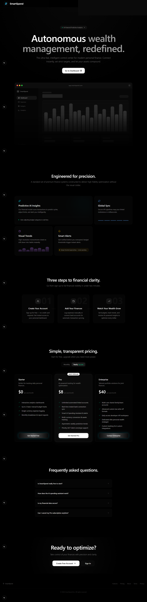
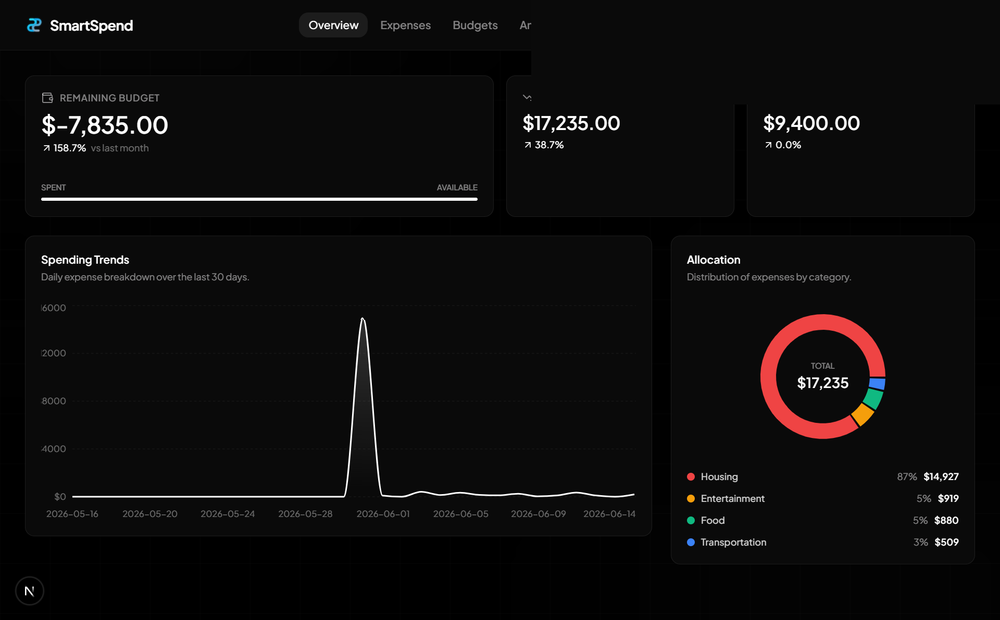
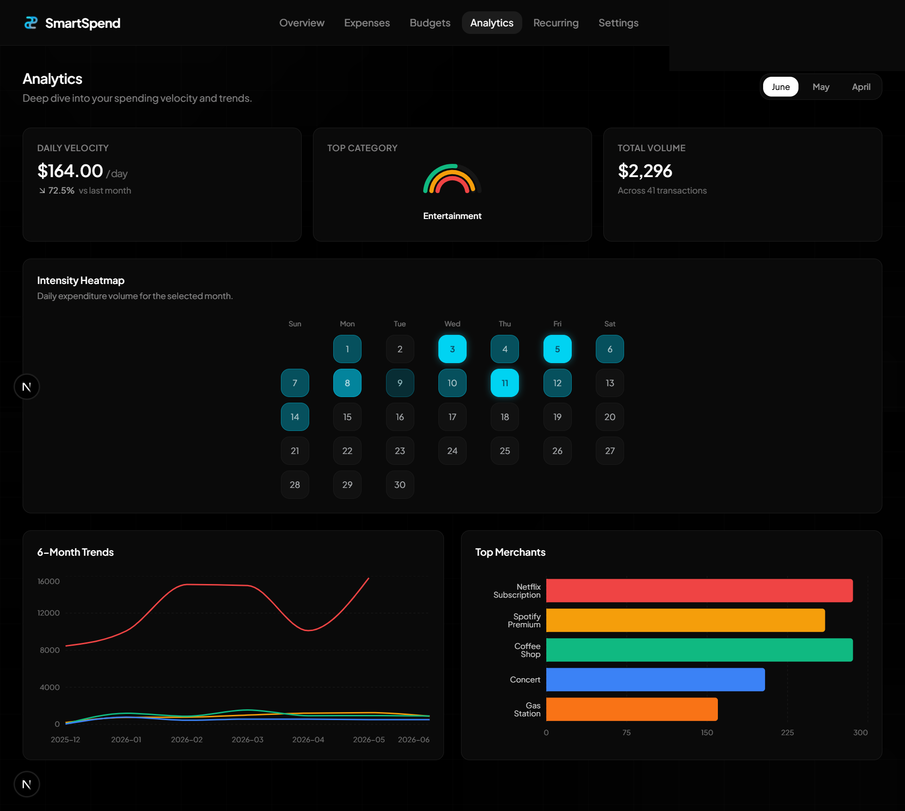

<p align="center">
  <h1 align="center">SmartSpend</h1>
  <p align="center">
    <strong>Autonomous Wealth Management — Redefined.</strong>
    <br />
    A full-stack personal finance SaaS application built with Next.js, TypeScript, MongoDB, and Stripe.
  </p>
</p>

<br />

## 📸 Screenshots

### Landing Page

<p align="center">
  
</p>

### Dashboard

<p align="center">
  
</p>

### Analytics

<p align="center">
  
</p>

<br />

## ✨ Features

- **Authentication** — Email/password via NextAuth v4
- **Expense Tracking** — Category filters, recurring expenses, and bulk management
- **Dashboard Analytics** — Spending trends, category distribution, recent transactions, and savings rate
- **Budget Planner** — Monthly limits with icons, colors, and warning states per category
- **Stripe Payments** — Checkout and billing portal for Pro subscriptions
- **Recurring Expenses** — Automated processing via Vercel Cron
- **Reports** — Exportable monthly breakdowns and summaries
- **AI Expense Categorizer** — Auto-suggests category from description on blur using OpenRouter
- **AI Monthly Insight** — Natural language 3-sentence spending summary generated per user
- **Anomaly Detection** — Flags categories spending 50%+ above weekly average
- **Secured Cron** — Recurring expense route protected with bearer token auth
- **CI/CD** — GitHub Actions pipeline with lint, type-check, and build gates on every push

<br />

## 🛠 Tech Stack

| Area | Technology |
|------|-----------|
| **Framework** | Next.js 16 (App Router) |
| **Language** | TypeScript |
| **Database** | MongoDB Atlas + Mongoose |
| **Auth** | NextAuth v4, bcryptjs |
| **Payments** | Stripe |
| **Email** | Resend |
| **Styling** | Tailwind CSS v4, Framer Motion |
| **Icons** | Lucide React |
| **Charts** | Recharts |
| **AI** | OpenRouter API (free tier, auto model routing) |

<br />

## 🚀 Getting Started

### Prerequisites

- Node.js 18+
- MongoDB Atlas cluster (or local MongoDB)
- Stripe account (for payment features)

### Installation

```bash
# Clone the repository
git clone https://github.com/mhaseebhassan/Saas-SmartSpend.git
cd Saas-SmartSpend

# Install dependencies
npm install
```

### Environment Variables

Create a `.env.local` file in the project root:

```env
MONGODB_URI=mongodb+srv://<user>:<password>@<cluster>/<database>?retryWrites=true&w=majority&appName=<app>
NEXTAUTH_URL=http://localhost:3000
NEXTAUTH_SECRET=<strong-secret>


# Stripe
NEXT_PUBLIC_STRIPE_PUBLISHABLE_KEY=<stripe-publishable-key>
STRIPE_SECRET_KEY=<stripe-secret-key>
STRIPE_WEBHOOK_SECRET=<stripe-webhook-secret>
STRIPE_PRICE_ID=<stripe-price-id>

# Email (optional)
RESEND_API_KEY=<resend-api-key>
EMAIL_FROM=<verified-sender>

# Cron Security
CRON_SECRET=<random-32-char-string>

# AI via OpenRouter (free tier)
OPENROUTER_API_KEY=<from openrouter.ai>
OPENROUTER_BASE_URL=https://openrouter.ai/api/v1
```

> **Note:** If local Node DNS has trouble resolving Atlas `mongodb+srv` records, add `MONGODB_DNS_SERVERS=1.1.1.1,8.8.8.8` to your `.env.local`.

### Run Locally

```bash
# Seed demo data (optional)
npm run seed

# Start development server
npm run dev
```


## 📜 Available Scripts

| Command | Description |
|---------|-------------|
| `npm run dev` | Start development server |
| `npm run build` | Create production build |
| `npm run start` | Start production server |
| `npm run lint` | Run ESLint |
| `npm run seed` | Seed database with demo data |

<br />

## 🌐 Deployment

This project is configured for Vercel deployment.

- `npm run build` passes with Next.js 16 production output
- `vercel.json` includes the daily cron route at `/api/expenses/process-recurring`
- Set `NEXTAUTH_URL` to your production Vercel URL (not `localhost`)
- All environment variables must be configured in Vercel project settings before deploy

> **Security Note:** The cron route is protected via `CRON_SECRET` bearer token validation.

<br />

## 🤖 AI Features

Powered by [OpenRouter](https://openrouter.ai) free tier — no cost.

| Feature | Endpoint | Description |
|---------|----------|-------------|
| Expense Categorizer | POST /api/ai/categorize | Auto-fills category from description |
| Monthly Insight | GET /api/ai/insight | 3-sentence natural language spending summary |
| Anomaly Detection | GET /api/ai/anomalies | Statistical spike detection, no LLM |

Get a free API key at openrouter.ai.

## ⚙️ CI/CD

GitHub Actions runs on every push to `main` and `dev` — lint, TypeScript check, production build.

Add these secrets to **GitHub repo → Settings → Secrets and variables → Actions**:
`MONGODB_URI`, `NEXTAUTH_SECRET`, `NEXTAUTH_URL`, `NEXT_PUBLIC_STRIPE_PUBLISHABLE_KEY`, `STRIPE_SECRET_KEY`, `STRIPE_WEBHOOK_SECRET`, `STRIPE_PRICE_ID`, `CRON_SECRET`, `OPENROUTER_API_KEY`

<br />

## 📋 Next Steps for Production

### 1. Push to GitHub
1. Commit your changes: `git add . && git commit -m "feat: integrate AI features, CI/CD, and cron security"`
2. Push to your repository: `git push origin main`
3. Go to your GitHub repository and verify that the new **GitHub Actions CI** pipeline is running and passes successfully.

### 2. Configure Vercel
1. Go to your [Vercel Dashboard](https://vercel.com/dashboard) and select the `Saas-SmartSpend` project.
2. Navigate to **Settings → Environment Variables**.
3. Add the following new environment variables exactly as they are in your `.env.local`:
   - `CRON_SECRET`
   - `OPENROUTER_API_KEY`
   - `OPENROUTER_BASE_URL`
4. Go to the **Deployments** tab and trigger a new deployment (or just wait for the automatic deployment triggered by your GitHub push).

### 3. Verify Cron Job
1. In the Vercel Dashboard, go to your project's **Settings → Cron Jobs**.
2. You should see `/api/expenses/process-recurring` scheduled to run daily at `0 0 * * *` (midnight UTC).
3. You can click **Run** to test it manually. It should succeed because Vercel automatically injects the `CRON_SECRET` from your environment variables.

<br />

## 📄 License

This project is for portfolio and demonstration purposes.
