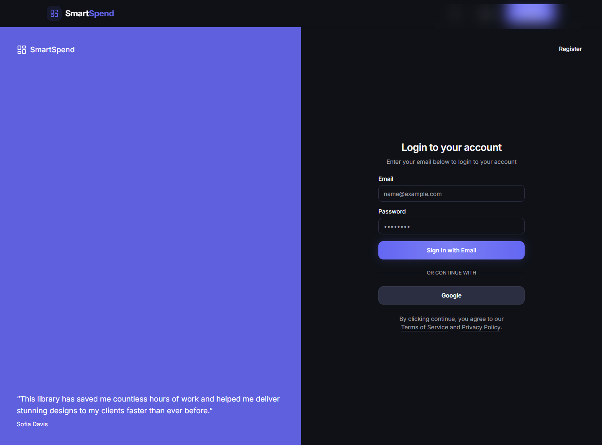
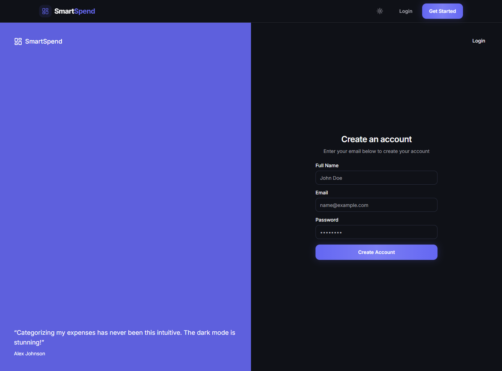
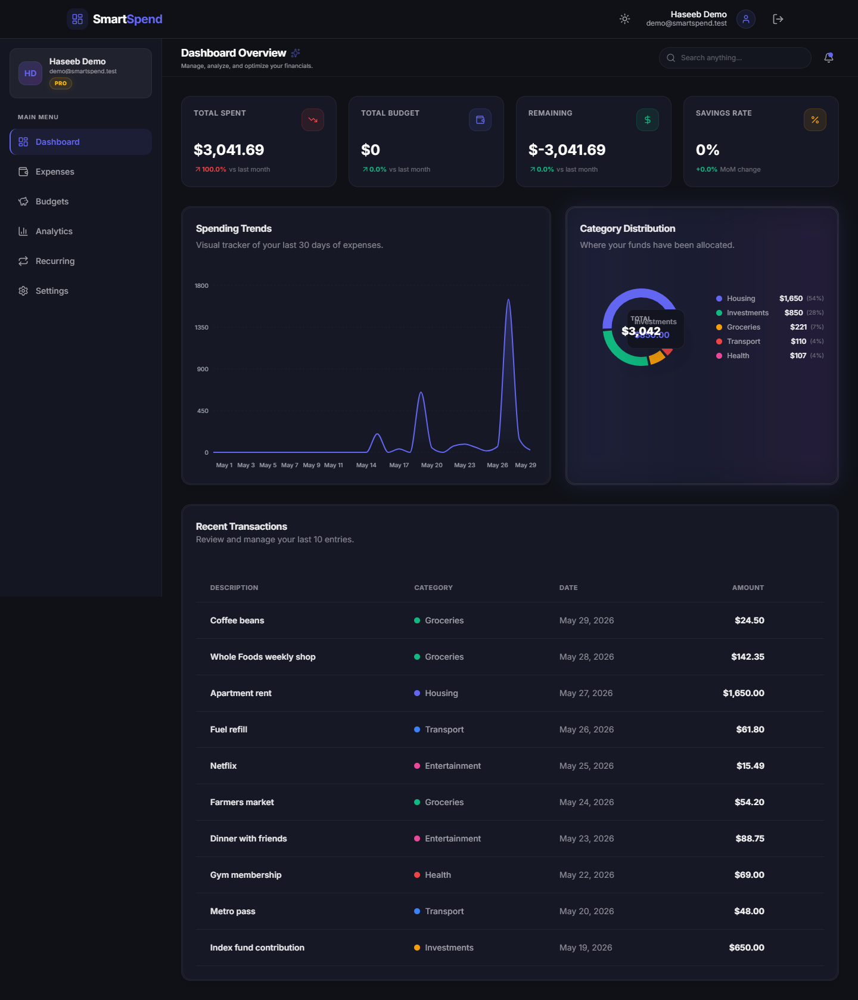
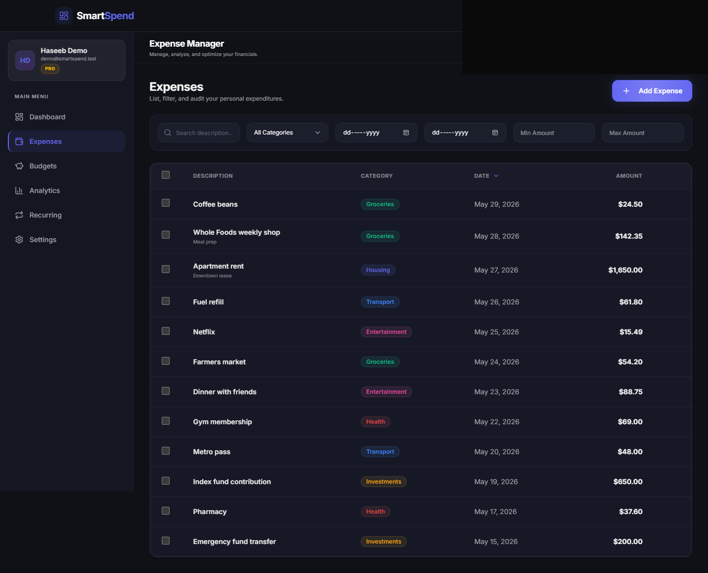
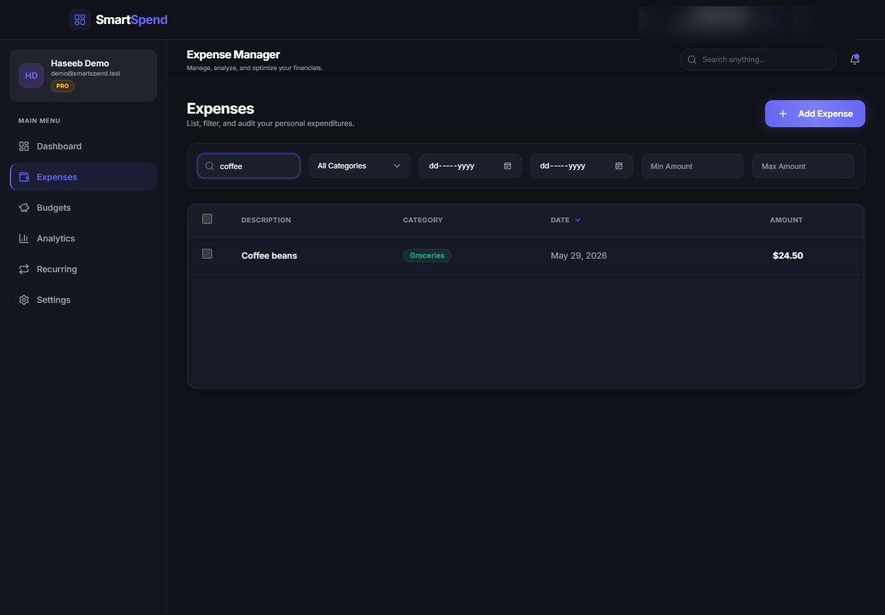
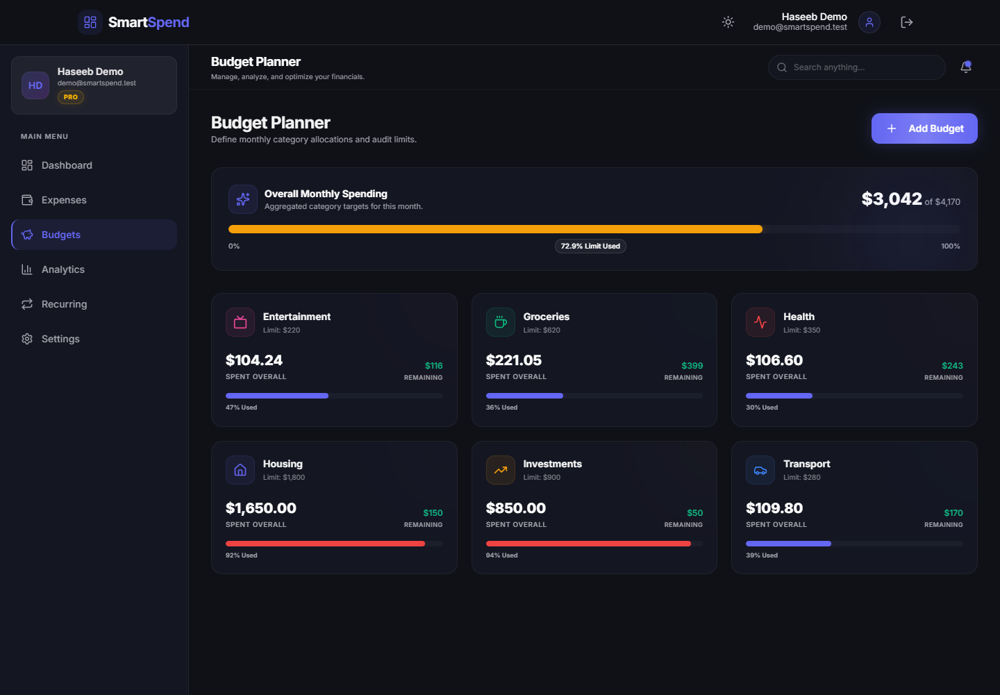
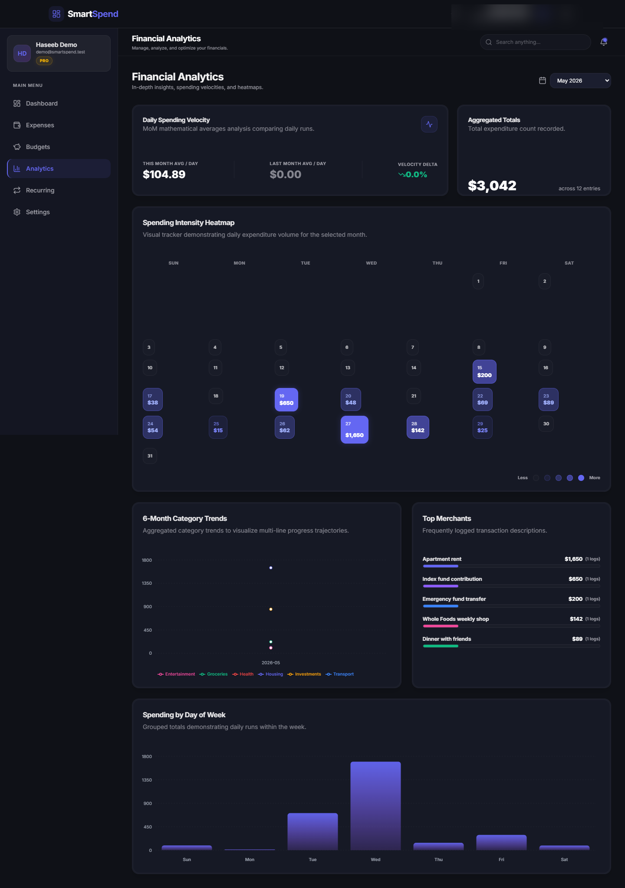
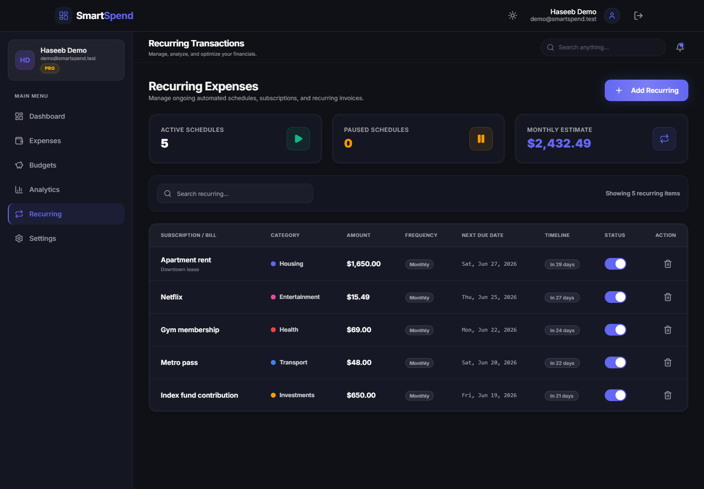
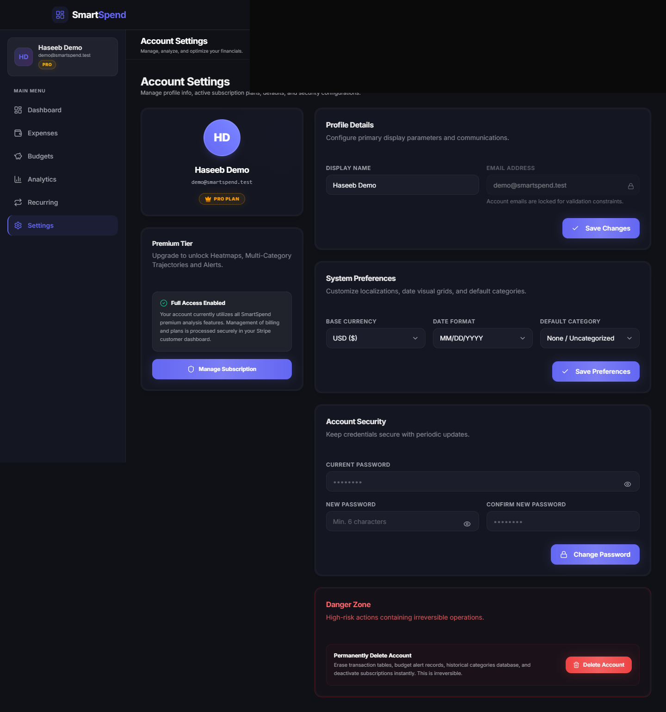
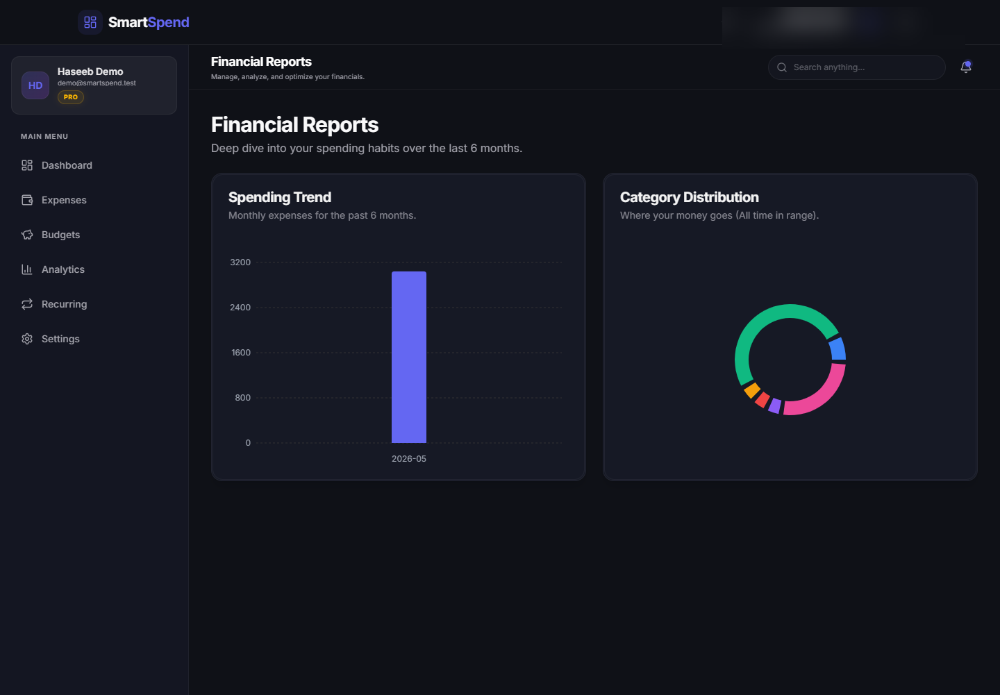

# SmartSpend

SmartSpend is a full-stack personal finance SaaS built with Next.js App Router, TypeScript, MongoDB, NextAuth, Stripe, Tailwind CSS, Framer Motion, and Recharts.

## Screenshots

### Public Pages






### Authenticated App

















## Features

- Email/password and Google OAuth authentication with NextAuth.
- Expense tracking with category filters, recurring expenses, and bulk management.
- Dashboard analytics for spending trends, category distribution, recent transactions, and savings rate.
- Category budgets with monthly limits, icons, colors, and warning states.
- Stripe checkout and billing portal routes for Pro subscriptions.
- Vercel Cron configuration for recurring expense processing.

## Tech Stack

| Area | Technology |
| --- | --- |
| Framework | Next.js 16 App Router |
| Language | TypeScript |
| Database | MongoDB Atlas with Mongoose |
| Auth | NextAuth v4, bcryptjs |
| Payments | Stripe |
| Email | Resend |
| UI | Tailwind CSS v4, Framer Motion, Lucide React |
| Charts | Recharts |

## Local Setup

```bash
npm install
npm run seed
npm run build
npm run start
```

The seed command creates three test accounts with realistic finance data:

- Email: `demo@smartspend.test`
- Email: `maya@smartspend.test`
- Email: `omar@smartspend.test`
- Password: `SmartSpend123!`

Create `.env.local` with:

```env
MONGODB_URI=mongodb+srv://<user>:<password>@<cluster>/<database>?retryWrites=true&w=majority&appName=<app>
NEXTAUTH_URL=http://localhost:3000
NEXTAUTH_SECRET=<strong-secret>
GOOGLE_CLIENT_ID=<google-client-id>
GOOGLE_CLIENT_SECRET=<google-client-secret>
NEXT_PUBLIC_STRIPE_PUBLISHABLE_KEY=<stripe-publishable-key>
STRIPE_SECRET_KEY=<stripe-secret-key>
STRIPE_WEBHOOK_SECRET=<stripe-webhook-secret>
STRIPE_PRICE_ID=<stripe-price-id>
# STRIPE_PRO_PRICE_ID is also supported for backwards compatibility.
RESEND_API_KEY=<resend-api-key>
EMAIL_FROM=<verified-sender>
```

If local Node DNS has trouble resolving Atlas `mongodb+srv` records, set:

```env
MONGODB_DNS_SERVERS=1.1.1.1,8.8.8.8
```

## Vercel Deployment Audit

- `npm run build` passes with Next.js 16 production output.
- The old `middleware.ts` convention was migrated to `proxy.ts`, removing the Next 16 deprecation warning.
- `vercel.json` includes the daily cron route at `/api/expenses/process-recurring`.
- Required production env vars must be configured in Vercel before deploy: `MONGODB_URI`, `NEXTAUTH_URL`, `NEXTAUTH_SECRET`, Stripe keys, Google OAuth keys, and Resend keys if email is enabled.
- `NEXTAUTH_URL` must use the deployed Vercel production URL, not `localhost`.
- The cron route is publicly reachable by design in the current code. For production hardening, add a cron secret header or query token before relying on it for paid usage.
- Current lint status has warnings only for `img` usage in navigation/avatar components.

## Scripts

```bash
npm run dev
npm run build
npm run start
npm run lint
npm run seed
```
